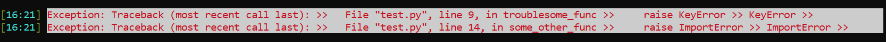
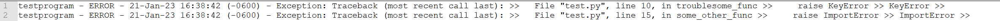
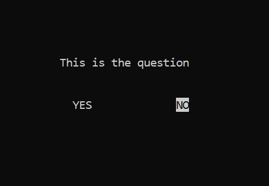
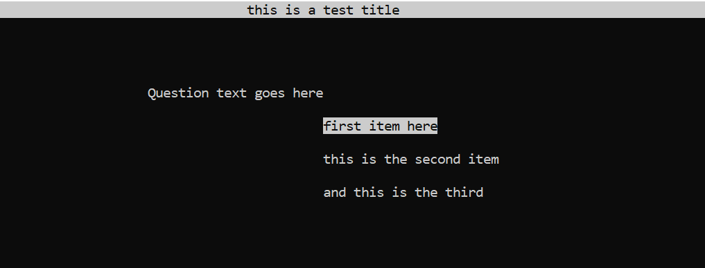
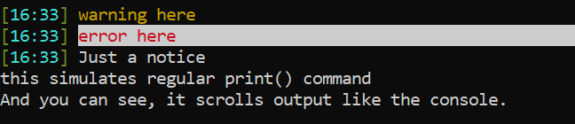

# uiblack
> Streamlined cross-platform Textual UI.

Attractive console output should not be walled behind libCurses! It should not take dozens of lines just to describe ordinary things like menus or basic prompts. Lastly, attractive console applications should not be limited to only Linux & OSX.

Those are the guiding thoughts behind uiblack. A truly cross-platform, dead simple, concise library that handles several mundane development tasks all at once.


## Installation

OS X, Linux & Windows:

```sh
pip install uiblack
```


## Logging
To keep things simple and cross-platform, logs are generated in the eecution directory. (This particular behavior may be subject to change in future builds.)

By default, [INFO] level messages are logged.

To update the logging level, please use the syslog values specified here:
https://en.wikipedia.org/wiki/Syslog#Severity_level

```python
from uiblack.terminal import UIBlackTerminal

# If you want to specify logging parameters:

# Name of log file to be written in local directory (Only Alphanumeric chars permitted)
log_name = "yourprogram"

# Whether the log should be started anew upon each execution
restart_log = False

# 0 - 7 Conforms to https://en.wikipedia.org/wiki/Syslog#Severity_level
log_level = 4

ui = UIBlackTerminal(log_name, restart_log=restart_log, log_level=log_level)
```
## Error handling
If you want to wrap a troublesome function or your entire program in a exception handler that correctly prints to the screen and logs, just add some "pie"!

### This process:
- Catches all exceptions
- Formats them into a single line
- Keeps only the last segment of the traceback (the part we actually care about)
- Prints correctly to the virtual UIBlack console
- Logs the event WITH traceback in the log file under a single human-readable line
```python
from uiblack.terminal import UIBlackTerminal

ui = UIBlackTerminal("yourprogram")

@ui.wrapper  # Notice the function is wrapped using "pie" syntax before each function
def troublesome_func():
    raise KeyError

@ui.wrapper
def some_other_func(param):
    raise ImportError
```
###Console output

###Syslog output


## Usage examples
Keep it simple. Just import, instance the library, and use it!

```python
from uiblack.terminal import UIBlackTerminal

# Run with defaults works just fine if logging parameters do not need to be altered
ui = UIBlackTerminal("yourprogram")
ui.clear()

result = ui.input("This is the input question")
ui.print_center(result)

result = ui.ask_yn("This is the question")
ui.print_center(result)
```


```python
for items in range(0, 5000, 2):
    ui.load_bar("This is the title of a bar", items, 5000)

ui.set_main_title("this is a test title")

result = ui.ask_list("Question text goes here",
                     ["first item here",
                      "this is the second item",
                      "and this is the third"],
                     )
```

```python

ui.warn("warning here")
ui.error("error here")
ui.notice("Just a notice")

ui.console("this simulates regular print() command")
ui.console("And you can see, it scrolls output like the console.")
```


## Meta

Brandon Blackburn – [PGP Encrypted Chat @ Keybase](https://keybase.io/blackburnhax/chat)

Distributed under the Apache 2.0 license. See ``LICENSE`` for more information.

_TL;DR:_
For a human-readable & fast explanation of the Apache 2.0 license visit:  http://www.tldrlegal.com/l/apache2


[https://github.com/BlackburnHax/uiblack](https://github.com/BlackburnHax/uiblack)